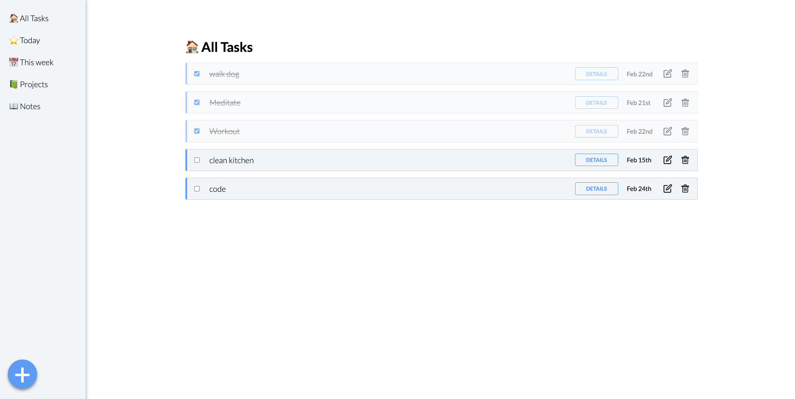

# ToDo-List
// TO-DO: Productivity App

Keep track of tasks with custom project folders and notes.

- Save to-do items to one of the default folders (All tasks, Today, This Week) or create a custom project.
- Save to-do items to individual project folders
- View to-do details, make an edit, delete and check off items.
- Edit the date of a to-do and it shows up in the right folder (Today or This Week) depending on the date set. 
- Three priority levels to assign a to-do item.
- Number of remaining unchecked items displayed by project name, total unchecked items displayed by Home title.
- Pinterest style notes section. Dynamically add, remove or edit notes.
- Fully responsive.
- Data saved to local storage.

Future ideas to implement: 
- Add a responsive counter for number of todos in each folder
- Sort by date/priority 
- Create logins and allow shared projects / notes between users

[Live App](https://hampusbosson.github.io/ToDo-List/)

